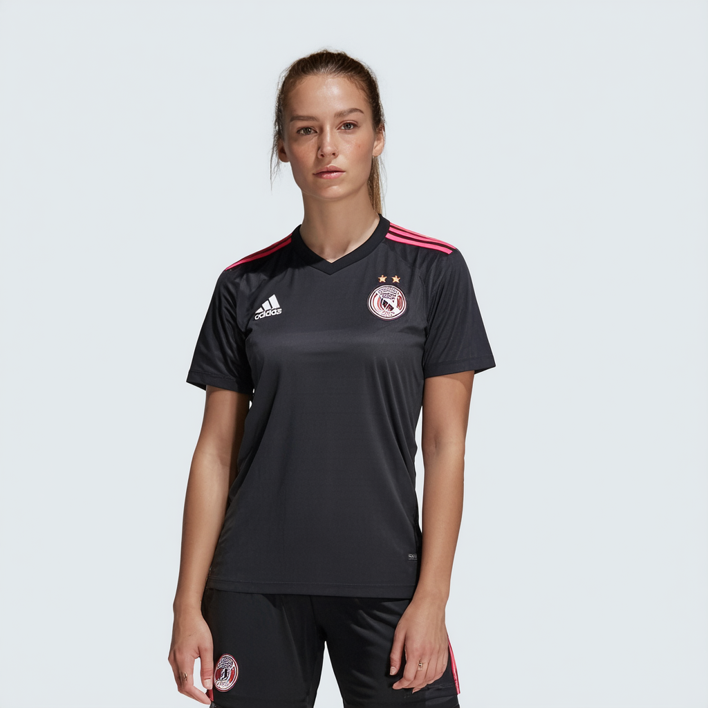

# OpenFake Dataset - Image-Prompt Mispairing Report
Two Notebooks to demonstrate the mispairing of four models in the dataset.

## Critical Issue
Systematic image-prompt mispairing affecting multiple models in the [OpenFake dataset](https://huggingface.co/datasets/ComplexDataLab/OpenFake).

## Findings
- **12 verified mislabeled samples** across 4 models
- ***almost 100% mismatch rate*** when filtering by affected models
- **Affected models:** flux.1-dev, sd-3.5, sdxl-realvis-v5, sd-1.5-dreamshaper
- **Other models appear correct**

## Verification

### Specific Samples
See [`notebooks/OpenFake_Image_Prompt_Mispairing.ipynb`](notebooks/OpenFake_Image_Prompt_Mispairing.ipynb)
- Documents 12 specific examples with screenshots
- Shows complete mismatch between images and prompts

### Systematic Check
See [detailed results](/results/affected_samples.md) for further information (Code: [`notebooks/checking_affected_models.ipynb`](notebooks/checking_affected_models.ipynb))
- Verifies first 10 samples per affected model (human verification)
- Images are saved in [results/Screenshots](results/screenshots)
- Confirms 97,5% mispairing rate for these models

## Examples of Mispairing

**Prompt:** A photograph captures a tense scene where barricades set ablaze by protesters are shown in front of a building, with no visible individuals in the frame.

**Prompt:** A collectible Star Trek Captain Kirk quote fridge magnet featuring a photograph of William Shatner as Captain Kirk with the iconic phrase "Beam me up Scotty!" displayed prominently.

## Related Discussion
[HuggingFace Discussion](https://huggingface.co/datasets/ComplexDataLab/OpenFake/discussions/2)

## Dataset Indexing Note
HuggingFace viewer uses 1-based indexing, programmatic access is 0-based.
